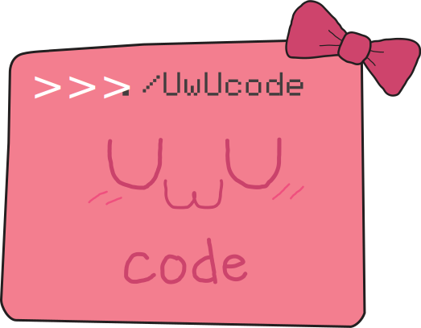

<br />
<p align="center">
  <a href="https://github.com/Theorvolt/uwucode">
    
  </a>

  <h3 align="center">uwucode</h3>

  <p align="center">
    A language based around egirl slang...
    <br />
    <br />
    <a href="https://github.com/Theorvolt/uwucode/issues">Report Bug / Request Feature</a>
  </p>
</p>


# Table of Contents

1. [What is uwucode?](#what-is-uwucode?)
    1. [Technical details](##technical-details)

2. [Getting started](#getting-started)
    1. [Cargo requirements](##cargo-requirements)
    2. [Building](##build-instructions)

3. [Writing with uwucode](#writing-with-uwucode)
   1. [Syntax](##syntax)

4. [Future plans](#future-plans)

5. [Contributing](#contributing)

6. [License](#license)

7. [Contact](#contact)

8. [Extra](#extra)
   1. [Why?](#why?)

9.  [Acknowledgements](#acknowledgements)


# What is uwucode?

uwucode is an interpreted language written in Rust and consists of a nonsensical grammar for keywords, for instance uwu and owo are used for function and variable declarations respectively. While the language itself brings no unique features, the code used to interpret the language is good for beginners who wish to learn about language design.

## Technical details

TBA.


# Getting Started

To get a local copy up and running follow these simple steps.

## Cargo requirements

The toml file contains information on any dependencies which are automatically fetched. 

## Build Instructions

1. Use Cargo to build uwucode.
    ```
    cargo build
    ```
2. Done.


# Writing with uwucode

Note: uwucode output often contains characters (emojis and colored text) that may not be readable by some terminals. 

Upon building uwucode, one may open a REPL by passing in the argument repl as follows:
```
uwucode repl
```

Alternatively, you can execute a file by using the open argument, supplying a file path, for instance:
```
uwucode open example.uwu
```

## Syntax

uwucode does not enforce typing and is interpreted. It is also independent of whitespace, which means indenting and spaces don't matter, but you must terminate the end of a statement. To define a variable, one would write:

```owo var = value :3```

For the sake of reference, `:3` can be replaced with `;`. For defining functions, the keyword `uwu` is utilised:

```
uwu square(x) {sugoi x*x;};
```

There are more examples in the examples folder, however a list of all keywords include: 

* owo - let
* uwu - define
* sugoi - return 
* nuzzles - if
* dab - elif
* rawr - else
* truwu - true
* fowose - false

As of now, there are also three builtins:

* quwuit - Takes in zero arguments, terminates the program.
* len - Returns the length of a string.
* dprint - Takes in one argument, prints the object.

_For more examples, please refer to the [Documentation](https://github.com/Theorvolt/uwucode/doc)_


# Roadmap

TBD, but there's a lot I have in mind. As of now, a few things that will come are:

* while loops
* a more robust interpreter
* inputs
* basic logical operations
* compilation to bytecode

# Contributing

You forfeit any right to sue me should your sanity disappear while contributing to this code. Follow standard procedure if you wish to contribute, i.e fork->commit->pull request. You can also ask for a feature in the issues section.


# License

Distributed under the MIT License. See `LICENSE` for more information.


# Contact

Sai kumar Murali krishnan - [LinkedIn](https://www.linkedin.com/in/sai-kumar-murali-krishnan/) - theorvoltbusiness@gmail.com

Project Link: [https://github.com/Theorvolt/uwucode](https://github.com/Theorvolt/uwucode)


# Extra

## Why?

The inspiration for this language came about since a friend of mine had made a relatively simple gag language primarily using the letter X [over here](https://github.com/lduck11007/x/). I also wanted to learn a bit about language design and manually designing a parser was a painful but worthwhile experience. As for the actual language itself, we found it a funny idea to write docstrings in uwu speak, something I intend to add in the future. Either way, this language serves no practical use but is a great way to break into language design. I highly recommend checking out the following: [https://interpreterbook.com/](https://interpreterbook.com/). 

# Acknowledgements

* Thanks to Satya for inspiration on keywords for the language and designing the logo.
* 
* 


